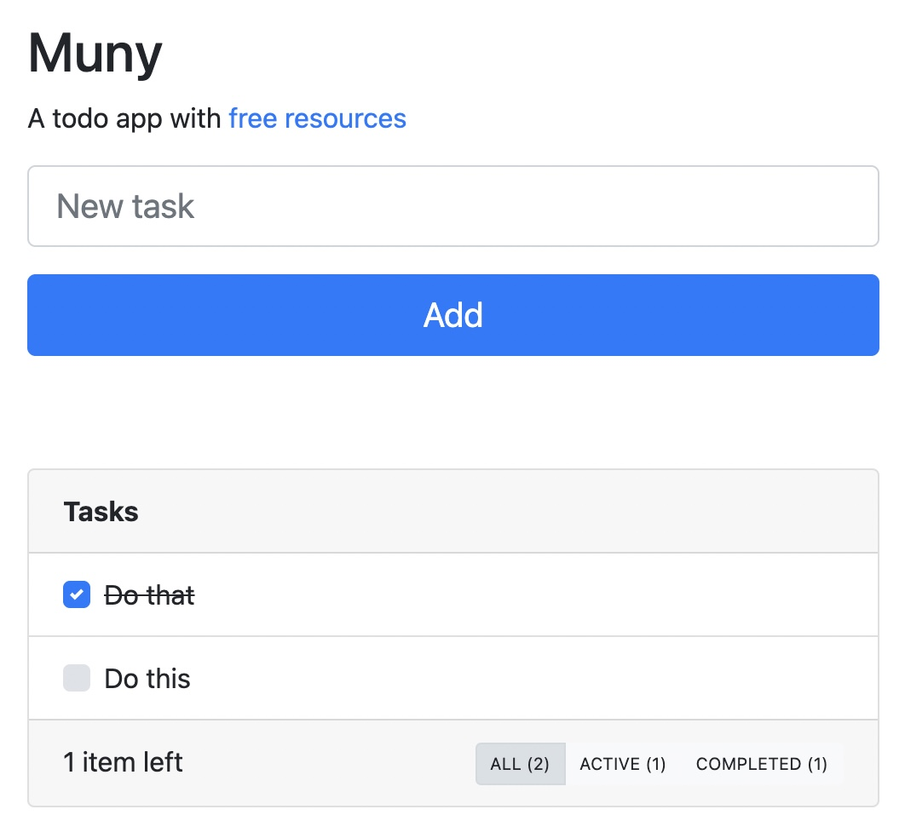

# muny

A todo app with free resources

[https://ozgrozer-muny.web.app/](https://ozgrozer-muny.web.app/)

## Usage

1. Fork this repo.
2. Register your domain at [Freenom](http://www.freenom.com/en/index.html?lang=en).
3. Create `A` records in [Freenom](https://my.freenom.com/clientarea.php?action=domains&language=english) (`Manage Domain/Manage Freenom DNS`) to point your domain to the [GitHub IP](https://help.github.com/articles/setting-up-an-apex-domain/#configuring-a-records-with-your-dns-provider)s.
4. Update your domain in `docs/CNAME`.
5. Create a new [Firebase](https://console.firebase.google.com/) project and get your credentials.
6. Update your Firebase credentials in `src/js/fire.js`.
7. You're ready to go.

## Dev

1. Fork this repo.
2. Clone your repo to your local computer with `git clone`.
3. Install dependencies with `yarn install` or `npm install`.
4. Start development with `yarn start` or `npm start`.
5. Build your app with `yarn build` or `npm run build`.
6. Push your code.

## Resources

1. [Freenom](http://www.freenom.com/en/index.html?lang=en) for free `.ml` TLD.
2. [Firebase](https://firebase.google.com/) for free database.
3. [Let's Encrypt](https://letsencrypt.org/) for free SSL certificate. (GitHub handles this.)
4. [GitHub Pages](https://pages.github.com/) for free web hosting.
5. [GitHub](https://github.com/) for free file hosting.

## Tools

1. [Git](https://git-scm.com/) for version control.
2. [Atom](https://atom.io/) for text editor.

## Dependencies

1. [@firebase/app](https://www.npmjs.com/package/@firebase/app) for to use Firebase plugins.
2. [@firebase/database](https://www.npmjs.com/package/@firebase/database) for to use Firebase database.
3. [axios](https://www.npmjs.com/package/axios) for to make XHR requests.
4. [babel-preset-env](https://www.npmjs.com/package/babel-preset-env) for to compile ES6+ to ES5.
5. [babel-preset-react](https://www.npmjs.com/package/babel-preset-react) for to compile React syntax.
6. [bootstrap](https://www.npmjs.com/package/bootstrap) for to make front-end UI. (CSS)
7. [node-sass](https://www.npmjs.com/package/node-sass) for compile SCSS to CSS.
8. [parcel-bundler](https://www.npmjs.com/package/parcel-bundler) for to bundle app.
9. [react](https://www.npmjs.com/package/react) for to make front-end UI. (JS)
10. [react-dom](https://www.npmjs.com/package/react-dom) for to render React app.
